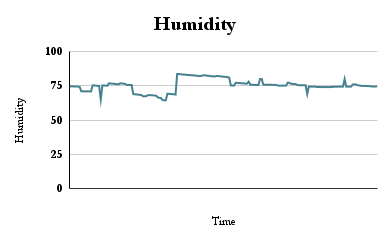

# Summary:
> The graphs is of the 8 kinds of data recieved to the google sheets in realtime through the NodeMCU board . These are made using google sheets . The Google Sheet Link is : [Link ](https://docs.google.com/spreadsheets/d/1k56KIS2q_07G4E5_XK3pnT_U33DqlmRvySdTY-wtpN4/edit?usp=sharing)
-The Google Sheets in Realtime is hostedin the above link.

- The charts made are line charts using the Insert->Charts property of the google sheets and the column size is extended upto 500 data values so the new data incoming that will be stored in the google sheets in realtime will also be updated in the graphs as well.
- The Graphs are Properly aligned in the right of te table. To understand the properties and creation of this google sheets table in the real time , click [HERE](../Google-Sheets/README.md)
- The sensor values shown in the graph is as per date and time which is also logged in the google sheets so here time is not continuous and whenever we turn on our Cattle-Animal-Health-Tracker device , the sensor values at that point of time will be logged in the graphand as we can see from the google sheets above as well that the date and time correspoindingly is also logged along with the sensor values of all the 8 sensors.
- Hence, the X-axis i.e. time does not represent continous but is of different ddate and time but is represented in graph with equal time intervals.
- At a time wen we begin logging the data usually upto 6-7 discrete and regular values are logged in equal time intervals based on interval of our request which is around 5-10 seconds but may vary as per the connection and the values taken from the arduino which itself processes the sensor values in around 2-3 seconds. Also there are limitations on sensors like dht-22 which takes around 2-3 seconds to recieve another data value.
- Therefore upto 1 minutes at a time 6-7 rows i.e. 6*8 =48 where 8 is the different cvalues we are recieving hence upto 50 values we are able to log at a time. But this factor 8 does not factor as we are sending as a string and later processing here in google scripts itself but based on different delays and asynchronous time difference creation ,we can still log upto 8 times at a time.
- Graphs are made on these all value logged and as told more incoming values coming will also be handled by the same and graph and the google sheets will itself be updated in realtime.
> NOTE: In the graphs, time is not continous and is based on different date and time and is synchronized in regular time periods to represent the values. Hence in some graphs ,we may see huge differences but to a certain range signifying the sensor values recieved on different days.

1. Humidity :
- Below image showing the humidity values takeen from the dht-22 sensor. DHT-22 gives us many different types of values and as per need we have analysed 4 different set of data i.e. Humidity(in percentage),Temperature(in degrees celsius and fahrenheit),Heat Index(in degrees celsius and fahrenheit).
- 
2. Temperature (in degrees celsius and fahrenheit):

  
  

