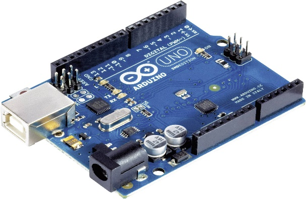
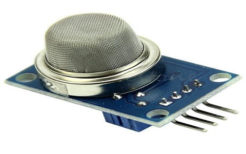
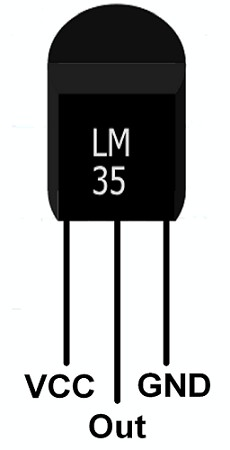
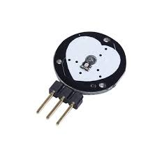
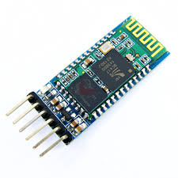

# Cattle Animal Health Monitoring System

## Project Report

### Introduction

In recent years, the intersection of technology and agriculture has paved the way for innovative solutions aimed at improving animal welfare and productivity. Among these advancements, using Arduino-based systems for animal health monitoring has gained significant traction. This report provides an overview of the development, functionality, and potential impact of an animal health monitoring device powered by Arduino technology.

### Objectives

The motivation behind creating cattle health monitoring devices stems from a few key areas:

- **Improved Animal Welfare:** Early detection of illness allows farmers to intervene sooner, reducing suffering and improving the overall well-being of their cattle.
- **Increased Productivity:** Healthy cattle are more productive, producing more milk or meat. By catching health issues early, farmers can minimize production losses.
- **Reduced Healthcare Costs:** Early intervention can prevent minor illnesses from developing into more serious and expensive problems.
- **Improved Efficiency:** Monitoring devices can automate tasks like data collection on temperature, respiration, and activity levels, freeing up farmers’ time to focus on other areas.
- **Disease Prevention:** By monitoring herd health, farmers can identify potential outbreaks sooner and take steps to isolate sick animals, preventing the spread of disease.

These factors all contribute to a more profitable and sustainable cattle farming industry.

### Development Phases

- **15/03/2024:** Project Acceptance
- **15/03/2024 - 17/03/2024:** Research Phase
- **20/03/2024 - 05/04/2024:** Development, Learning and Research Phase
- **07/04/2024 - 09/04/2024:** Hardware Development and Training of AI Model
- **10/04/2024:** Hardware Integration
- **11/04/2024:** Alpha Testing and Spotting of Errors
- **12/04/2024:** Rectifying Errors in Functioning of Segregator and Model
- **13/04/2024:** Finishing Touches and Finalised Product

### Components Used

The Cattle Health Monitoring System is designed to provide comprehensive data acquisition and real-time communication for improved animal well-being and farm management. This report details the selection of core components chosen for their reliability, functionality, and contribution to a robust animal health monitoring solution.

- **Microcontroller Unit:** The system utilizes an [Arduino Uno](https://www.arduino.cc/en/Guide/Introduction) microcontroller as its central processing unit.
  

- **Gas/Smoke Sensor:** The [MQ-2](https://www.sparkfun.com/datasheets/Sensors/Biometric/MQ-2.pdf) gas/smoke sensor module detects a wide spectrum of potentially harmful gases.
  

- **Temperature Sensor:** The [LM35](https://www.ti.com/lit/ds/symlink/lm35.pdf) temperature sensor plays a critical role in monitoring ambient temperature.
  

- **Pulse Sensor:** To precisely monitor the vital signs of livestock.
  

- **Bluetooth Module:** The [HC05](https://cdn.sparkfun.com/datasheets/Wireless/Bluetooth/HC-05-Bluetooth.pdf) Bluetooth module facilitates wireless communication.
  

### Methodology

**Objectives:**

- Continuous real-time monitoring for early detection of abnormalities.
- Prompt identification of health issues, potentially improving outcomes.
- Proactive alerts for timely intervention, reducing risks and complications.
- Cloud-based data processing and analysis using advanced analytics and machine learning for actionable insights.

**Design:**

The Arduino board runs a custom firmware/software program that controls the device’s operation. Arduino continuously reads sensor data, processes it, and packages it for transmission via the HC-05 Bluetooth module. The firmware/software implements algorithms to analyze sensor data, detect anomalies, and trigger alerts if necessary.

### Future Scope

- **Integration of Additional Sensors:**
  - **Activity Level Monitoring:** Incorporate accelerometer or gyroscope sensors.
  - **Respiratory Rate Monitoring:** Integrate respiratory rate sensors or algorithms.

- **Implementation of Machine Learning Algorithms:**
  - **Health Trend Analysis:** Develop machine learning algorithms for trend analysis.
  - **Anomaly Detection:** Train machine learning models for detecting anomalies.

- **Development of a Cloud-Based Platform:**
  - **Centralized Data Storage:** Create a cloud-based platform for data storage.
  - **Multi-Device Management:** Manage and monitor multiple animals.
  - **Remote Monitoring and Alerts:** Real-time remote monitoring capabilities.

### Challenges Faced

**During Development:**

- [Text for challenges faced during the development phase]

**Expected Challenges During Implementation:**

- [Text for expected challenges during the implementation phase]

### Contributions of Project Members

- **Prasanna Mishra:** Contribution and learning.
- **Prasun Baranwal:** Contribution and learning.
- [Add other members if applicable]

### Readiness for Product Marketing and Commercialization

- [Text for readiness for product marketing and commercialization]

### References

- [Arduino Platform Overview](https://www.arduino.cc/en/Guide/Introduction)
- [MQ-2 Gas Sensor Module Datasheet](https://www.sparkfun.com/datasheets/Sensors/Biometric/MQ-2.pdf)
- [LM35 Temperature Sensor Datasheet](https://www.ti.com/lit/ds/symlink/lm35.pdf)
- [HC-05 Bluetooth Module Datasheet](https://cdn.sparkfun.com/datasheets/Wireless/Bluetooth/HC-05-Bluetooth.pdf)
